# df-p10k-themes

[](https://github.com/bladhl/df-p10k-themes/actions/workflows/ci.yml)
[](LICENSE)

> Swap palettes and accent colors on your Powerlevel10k prompt — without ever
> touching your `~/.p10k.zsh`.

## Why

[Powerlevel10k](https://github.com/romkatv/powerlevel10k) ships beautiful but
hardcoded colors. Changing them means hand-editing 100+ integer values in
`~/.p10k.zsh`, and any wizard re-run (`p10k configure`) wipes your edits.

`df-p10k-themes` solves this with an **additive override**: it drops a
palette-aware `active.zsh` into your config dir and sources it from `.zshrc`
*after* p10k loads. Your `~/.p10k.zsh` stays pristine.

## Theme previews

Every theme on its default accent, rendered with p10k's own `lean` preset.

### Dark

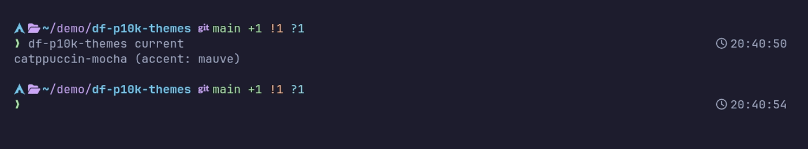
*`catppuccin-mocha`*

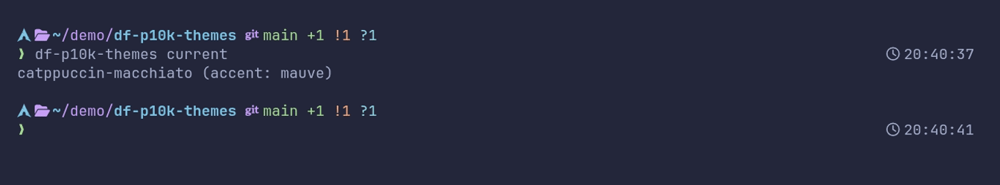
*`catppuccin-macchiato`*


*`catppuccin-frappe`*

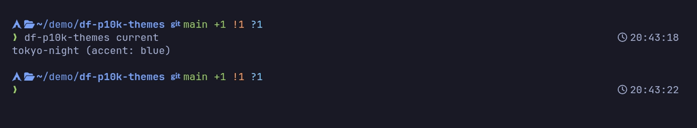
*`tokyo-night`*

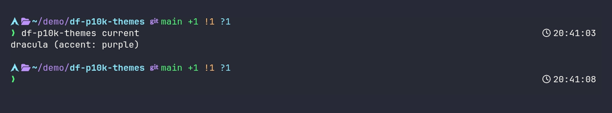
*`dracula`*

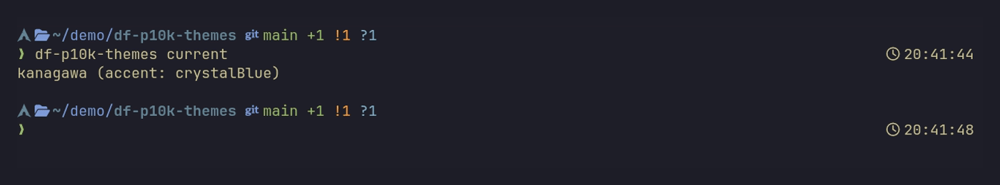
*`kanagawa`*

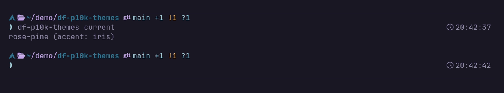
*`rose-pine`*

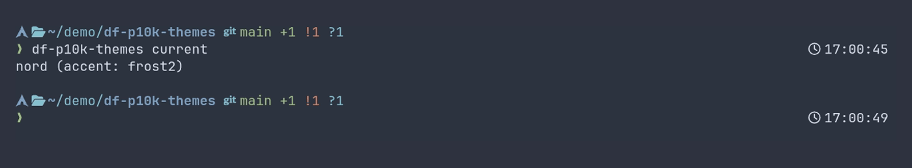
*`nord`*

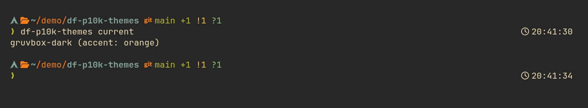
*`gruvbox-dark`*

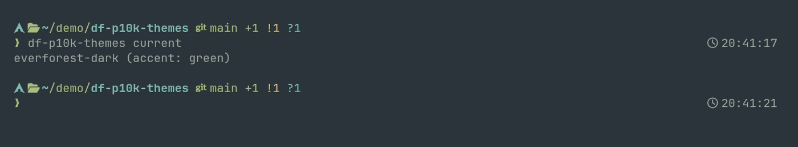
*`everforest-dark`*

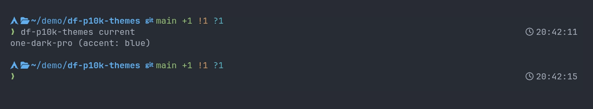
*`one-dark-pro`*

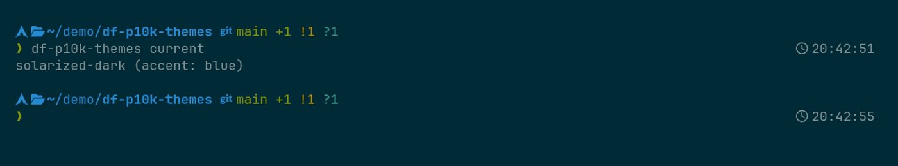
*`solarized-dark`*

### Light

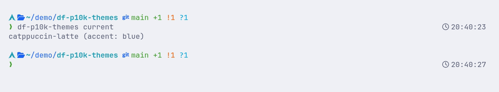
*`catppuccin-latte`*

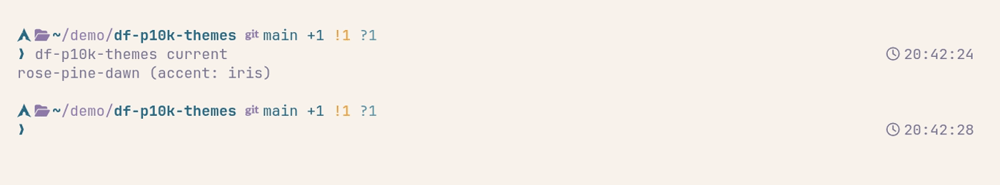
*`rose-pine-dawn`*

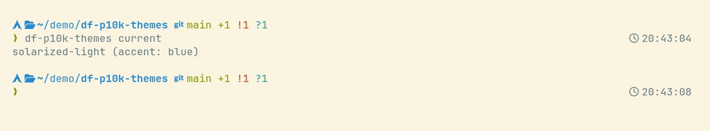
*`solarized-light`*

Previews are optional and captured per theme, so the OS icon reflects whoever
contributed it. `make screenshots THEME=<name>` does one with
[vhs](https://github.com/charmbracelet/vhs); by hand is fine too, as long as
it lands as a 1400×260 PNG. See [CONTRIBUTING.md](CONTRIBUTING.md).

## How it works

```
~/.zshrc                     unchanged + one managed source hook
   ↓ sources
~/.p10k.zsh                  unchanged
   ↓ then sources (from .zshrc hook)
~/.config/df-p10k-themes/active.zsh   <-- this tool writes here
   ↓ overrides
POWERLEVEL9K_*_FOREGROUND/_BACKGROUND vars and redefines `my_git_formatter`
```

Switching themes rewrites only `active.zsh`. Uninstall removes the managed hook
block from `.zshrc` and the override file. Your prompt config is yours.

## Prompt styles

`active.zsh` is sourced *after* `~/.p10k.zsh`, so it can see which p10k preset
you're running and adapt to it — no setting to pick, no config to keep in
sync:

| Style     | How it's detected                              | What we set |
|-----------|-------------------------------------------------|-------------|
| `lean`/`pure` | Neither of the below is set                  | A plain foreground per segment (today's look) |
| `classic` | `POWERLEVEL9K_BACKGROUND` is non-empty           | Same foregrounds, plus one shared segment background (`c_surface`) that replaces the preset's own gray |
| `rainbow` | `POWERLEVEL9K_DIR_BACKGROUND` is non-empty        | Each segment's hue becomes its background; the foreground is picked for contrast, not brand color |

> A `lean` config can set `POWERLEVEL9K_BACKGROUND=` to an **empty** string on
> purpose (a fully transparent prompt — the upstream `p10k-lean.zsh` itself
> does this). Detection treats that the same as "unset", never as "classic".

Every theme's `THEME_PALETTE` and the docs it ships were built against these
three presets. Anything more exotic (a hand-edited `~/.p10k.zsh` mixing
markers from more than one preset) isn't detected and falls back to `lean`.

`tests/contrast.bats` enforces WCAG 2.x contrast for every theme in every
style, and every theme passes it:

- **4.5:1** where the foreground is `c_text`, the neutral reading-text role,
  sitting directly on `c_base`/`c_surface` — the one pair here shaped like
  actual body text (WCAG 1.4.3).
- **3.0:1** everywhere else: every chromatic hue against `c_base`/`c_surface`
  in `lean`/`classic`, a rainbow segment's on-color foreground against its
  own hue-colored background, and `c_muted`/`c_subtext` in any style. Prompt
  segments are short, bold, colored UI labels, not paragraphs of body text —
  WCAG 1.4.11 (non-text/UI contrast) is the applicable floor for them.

A handful of accent colors didn't clear 3.0:1 against their theme's own
`c_base`/`c_surface` as shipped upstream. Each was retuned by the minimal
HSL lightness change needed to clear the bar, keeping its hue and saturation
untouched — so it reads as the same color, just legible. Every adjusted
value is commented inline in its `themes/<name>.zsh` with the ratio that
forced it.

## Install

```sh
curl -fsSL https://raw.githubusercontent.com/bladhl/df-p10k-themes/main/install.sh | bash
```

Or from a checkout:

```sh
git clone https://github.com/bladhl/df-p10k-themes.git
cd df-p10k-themes
./install.sh
```

This installs the CLI to `~/.local/bin` and the themes to
`~/.local/share/df-p10k-themes/themes`. Make sure `~/.local/bin` is on your
`PATH`.

## Quick start

```sh
df-p10k-themes init                          # one-time: add hook to ~/.zshrc
df-p10k-themes apply catppuccin-mocha        # use the theme's default accent
df-p10k-themes apply tokyo-night blue        # override accent
df-p10k-themes current                       # tokyo-night (accent: blue)
exec zsh                                     # reload prompt
```

Bare theme name works as a shortcut:

```sh
df-p10k-themes catppuccin-mocha peach        # same as `apply catppuccin-mocha peach`
```

## Commands

| Command                                 | What it does                                          |
|-----------------------------------------|-------------------------------------------------------|
| `init`                                  | Back up `~/.zshrc` and insert the source hook         |
| `apply <theme> [accent]`                | Render and activate a theme (with optional accent)    |
| `<theme> [accent]`                      | Shortcut for `apply`                                  |
| `list`                                  | List built-in themes and their default accents        |
| `accents <theme>`                       | List accent colors usable with a theme                |
| `current`                               | Print the currently applied theme + accent            |
| `uninstall`                             | Remove the hook, the active file, and the backup      |
| `--help`, `--version`                   | Self-explanatory                                      |

## Available themes

| Theme                  | Default accent | Notes                       |
|------------------------|----------------|-----------------------------|
| `catppuccin-mocha`     | `mauve`        | Dark (default Catppuccin)   |
| `catppuccin-frappe`    | `mauve`        | Dark (warmer)               |
| `catppuccin-macchiato` | `mauve`        | Dark (between Mocha/Frappé) |
| `catppuccin-latte`     | `blue`         | Light                       |
| `tokyo-night`          | `blue`         | Dark                        |
| `one-dark-pro`         | `blue`         | Dark (Atom-derived)         |
| `gruvbox-dark`         | `orange`       | Dark (retro)                |
| `nord`                 | `frost2`       | Dark (cool)                 |
| `dracula`              | `purple`       | Dark (high contrast)        |
| `rose-pine`            | `iris`         | Dark (muted, six accents)   |
| `rose-pine-dawn`       | `iris`         | Light                       |
| `kanagawa`             | `crystalBlue`  | Dark (warm, wide palette)   |
| `everforest-dark`      | `green`        | Dark (low contrast, green)  |
| `solarized-dark`       | `blue`         | Dark (the original)         |
| `solarized-light`      | `blue`         | Light                       |

Run `df-p10k-themes accents <theme>` to see all accent options for a theme.

## Environment variables

| Variable                    | Purpose                                            |
|-----------------------------|----------------------------------------------------|
| `XDG_CONFIG_HOME`           | Where `active.zsh` is written (defaults to `~/.config`) |
| `XDG_DATA_HOME`             | Fallback theme location (defaults to `~/.local/share`) |
| `DF_P10K_THEMES_DIR`        | Explicit theme directory override |
| `DF_P10K_THEMES_ZSHRC`      | Override path to `.zshrc` (used by tests)          |

Theme lookup order is the explicit directory override, checkout themes,
themes colocated with the installed executable, then the XDG data fallback.

## Uninstall

```sh
df-p10k-themes uninstall    # removes hook + active.zsh + backup if untouched
make uninstall              # removes CLI + theme files from $PREFIX
```

The uninstall verifies the resulting `.zshrc` is byte-identical to the backup
before removing the backup. If you made other edits to `.zshrc` after running
`init`, the backup is left in place at `~/.zshrc.df-p10k-themes.bak`.

## OS icon colors

Powerlevel10k already picks the right glyph for your distribution, but paints
every one of them the same color. `df-p10k-themes` maps the detected OS to the
closest hue in the active palette, so the icon keeps its vendor identity while
staying inside the theme:

| OS                                   | Hue         |
|--------------------------------------|-------------|
| Ubuntu, Amazon Linux                 | orange      |
| Debian, RHEL, FreeBSD                | red         |
| Android, Mint, Manjaro, openSUSE, Rocky, Void | green |
| Arch, NixOS, Mageia                  | sapphire    |
| Fedora, Alpine, Kali, AlmaLinux, Slackware | blue  |
| Gentoo, Devuan, CentOS               | purple      |
| Windows, elementary, Zorin           | sky         |
| macOS                                | subtext     |

Unmapped systems fall back to the theme accent. The full table lives in
`themes/_bindings.zsh` — adding a distro is one line.

> The `lean` and `classic` presets ship `os_icon` commented out. If you don't
> see the icon at all, add `os_icon` to `POWERLEVEL9K_LEFT_PROMPT_ELEMENTS` in
> your `~/.p10k.zsh` — that part is p10k's config, not ours.

## Contributing

See [CONTRIBUTING.md](CONTRIBUTING.md) for the theme contract, the OS icon
map, and the test commands (`make test`, `make lint`, `make syntax`).

## Design notes

- **Additive over destructive.** The previous experimental approach
  injected variable references directly into `~/.p10k.zsh`. That tied the
  tool's lifetime to file mutation, was wiped by `p10k configure`, and
  required brittle pattern-matching over 100+ assignments. This version
  flips the model: write a small dropin, leave the user's config alone.
- **Self-contained `active.zsh`.** Each `apply` writes a fully self-contained
  file — palette + bindings + formatter + optional accent overlay, all
  inlined. No runtime lookups, no source chains.
- **Function override for VCS.** P10k's default git formatter uses inline
  `%76F`-style color shorthand inside a `local` variable, which is captured
  at function-definition time and not overridable by variable reassignment.
  `_bindings.zsh` redefines `my_git_formatter` with palette-aware colors.

## License

[MIT](LICENSE)
