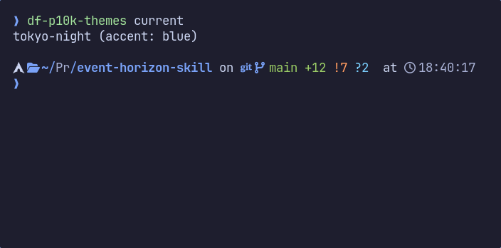
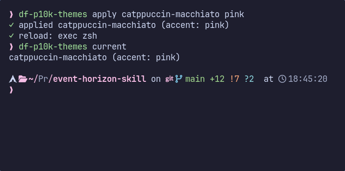

# df-p10k-themes

> Swap palettes and accent colors on your Powerlevel10k prompt — without ever
> touching your `~/.p10k.zsh`.

## Why

[Powerlevel10k](https://github.com/romkatv/powerlevel10k) ships beautiful but
hardcoded colors. Changing them means hand-editing 100+ integer values in
`~/.p10k.zsh`, and any wizard re-run (`p10k configure`) wipes your edits.

`df-p10k-themes` solves this with an **additive override**: it drops a
palette-aware `active.zsh` into your config dir and sources it from `.zshrc`
*after* p10k loads. Your `~/.p10k.zsh` stays pristine.

## Theme previews



*Tokyo Night with the `blue` accent.*



*Catppuccin Macchiato with the `pink` accent.*

## How it works

```
~/.zshrc                     unchanged + one managed source hook
   ↓ sources
~/.p10k.zsh                  unchanged
   ↓ then sources (from .zshrc hook)
~/.config/df-p10k-themes/active.zsh   <-- this tool writes here
   ↓ overrides
POWERLEVEL9K_*_FOREGROUND vars and redefines `my_git_formatter`
```

Switching themes rewrites only `active.zsh`. Uninstall removes the managed hook
block from `.zshrc` and the override file. Your prompt config is yours.

## Install

```sh
git clone https://github.com/bladhl/df-p10k-themes.git
cd df-p10k-themes
./install.sh
```

This installs the CLI to `~/.local/bin` and the themes to
`~/.local/share/df-p10k-themes/themes`. Make sure `~/.local/bin` is on your
`PATH`.

## Quick start

```sh
df-p10k-themes init                          # one-time: add hook to ~/.zshrc
df-p10k-themes apply catppuccin-mocha        # use the theme's default accent
df-p10k-themes apply tokyo-night blue        # override accent
df-p10k-themes current                       # tokyo-night (accent: blue)
exec zsh                                     # reload prompt
```

Bare theme name works as a shortcut:

```sh
df-p10k-themes catppuccin-mocha peach        # same as `apply catppuccin-mocha peach`
```

## Commands

| Command                                 | What it does                                          |
|-----------------------------------------|-------------------------------------------------------|
| `init`                                  | Back up `~/.zshrc` and insert the source hook         |
| `apply <theme> [accent]`                | Render and activate a theme (with optional accent)    |
| `<theme> [accent]`                      | Shortcut for `apply`                                  |
| `list`                                  | List built-in themes and their default accents        |
| `accents <theme>`                       | List accent colors usable with a theme                |
| `current`                               | Print the currently applied theme + accent            |
| `uninstall`                             | Remove the hook, the active file, and the backup      |
| `--help`, `--version`                   | Self-explanatory                                      |

## Available themes

| Theme                | Default accent | Notes                       |
|----------------------|----------------|-----------------------------|
| `catppuccin-mocha`   | `mauve`        | Dark (default Catppuccin)   |
| `catppuccin-frappe`  | `mauve`        | Dark (warmer)               |
| `catppuccin-macchiato` | `mauve`      | Dark (between Mocha/Frappé) |
| `catppuccin-latte`   | `blue`         | Light                       |
| `tokyo-night`        | `blue`         | Dark                        |
| `one-dark-pro`       | `blue`         | Dark (Atom-derived)         |
| `gruvbox-dark`       | `orange`       | Dark (retro)                |
| `nord`               | `frost2`       | Dark (cool)                 |

Run `df-p10k-themes accents <theme>` to see all accent options for a theme.

## Environment variables

| Variable                    | Purpose                                            |
|-----------------------------|----------------------------------------------------|
| `XDG_CONFIG_HOME`           | Where `active.zsh` is written (defaults to `~/.config`) |
| `XDG_DATA_HOME`             | Fallback theme location (defaults to `~/.local/share`) |
| `DF_P10K_THEMES_DIR`        | Explicit theme directory override |
| `DF_P10K_THEMES_ZSHRC`      | Override path to `.zshrc` (used by tests)          |

Theme lookup order is the explicit directory override, checkout themes,
themes colocated with the installed executable, then the XDG data fallback.

## Uninstall

```sh
df-p10k-themes uninstall    # removes hook + active.zsh + backup if untouched
make uninstall              # removes CLI + theme files from $PREFIX
```

The uninstall verifies the resulting `.zshrc` is byte-identical to the backup
before removing the backup. If you made other edits to `.zshrc` after running
`init`, the backup is left in place at `~/.zshrc.df-p10k-themes.bak`.

## Contributing a theme

1. Copy `themes/_template.zsh` to `themes/<your-theme>.zsh`.
2. Fill in `THEME_PALETTE`, `THEME_ACCENTS`, `THEME_ACCENT_DEFAULT`, and the
   `c_*` role globals.
3. `make syntax` to verify your file parses; `make test` to verify it composes
   into a valid `active.zsh`.
4. Open a PR.

The `_bindings.zsh` file owns every `POWERLEVEL9K_*_FOREGROUND` assignment and
the `my_git_formatter` redefinition, so theme files only deal with palette and
semantic role mapping. See `themes/catppuccin-mocha.zsh` for the reference
shape.

## Development

```sh
make test     # bats specs
make lint     # shellcheck on bin/df-p10k-themes
make syntax   # zsh -n on every theme file
```

Bats install:

```sh
# Arch / Manjaro
sudo pacman -S bash-bats shellcheck

# macOS
brew install bats-core shellcheck

# from source
git clone https://github.com/bats-core/bats-core.git
sudo bats-core/install.sh /usr/local
```

## Design notes

- **Additive over destructive.** The previous experimental approach
  injected variable references directly into `~/.p10k.zsh`. That tied the
  tool's lifetime to file mutation, was wiped by `p10k configure`, and
  required brittle pattern-matching over 100+ assignments. This version
  flips the model: write a small dropin, leave the user's config alone.
- **Self-contained `active.zsh`.** Each `apply` writes a fully self-contained
  file — palette + bindings + formatter + optional accent overlay, all
  inlined. No runtime lookups, no source chains.
- **Function override for VCS.** P10k's default git formatter uses inline
  `%76F`-style color shorthand inside a `local` variable, which is captured
  at function-definition time and not overridable by variable reassignment.
  `_bindings.zsh` redefines `my_git_formatter` with palette-aware colors.

## License

[MIT](LICENSE)
